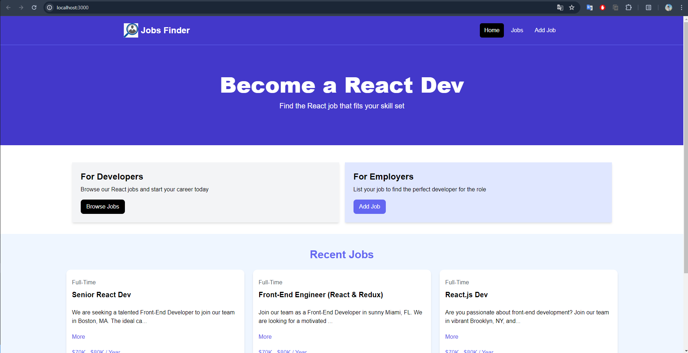
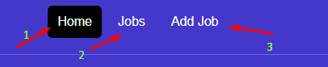
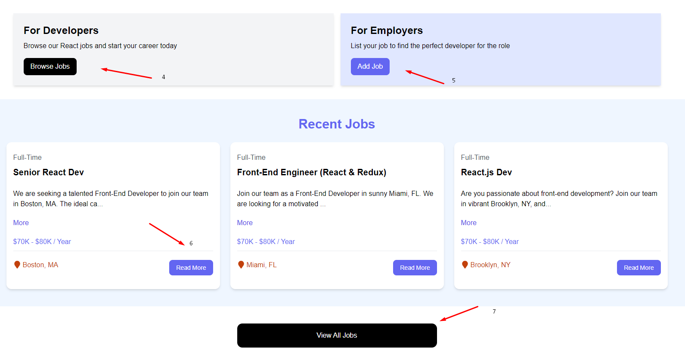
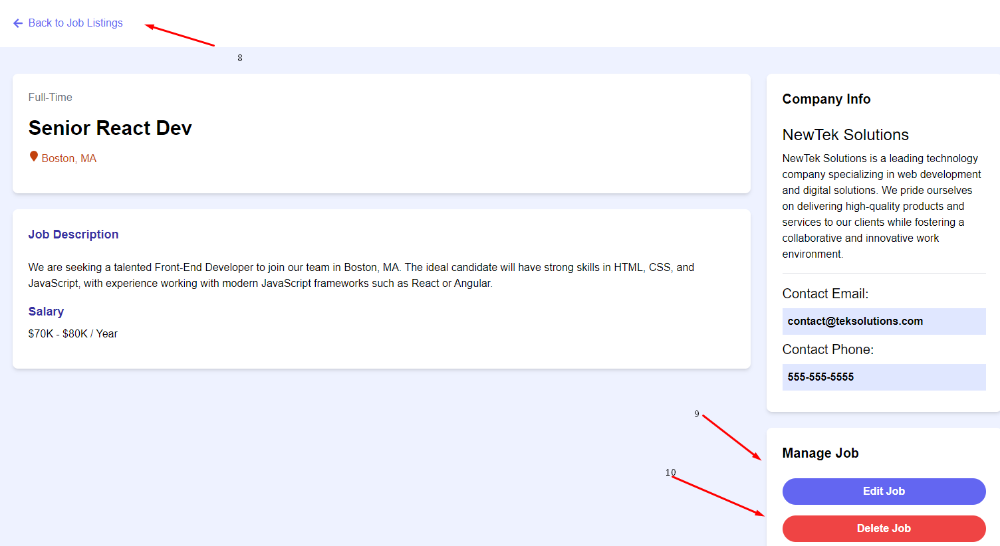
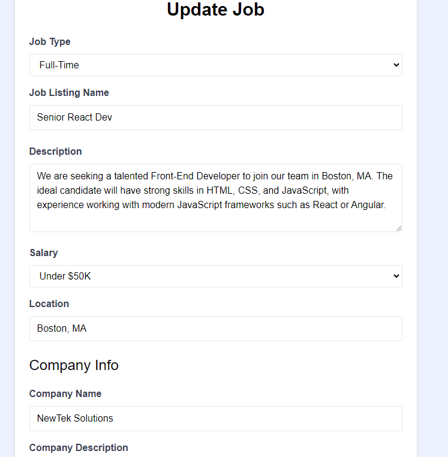
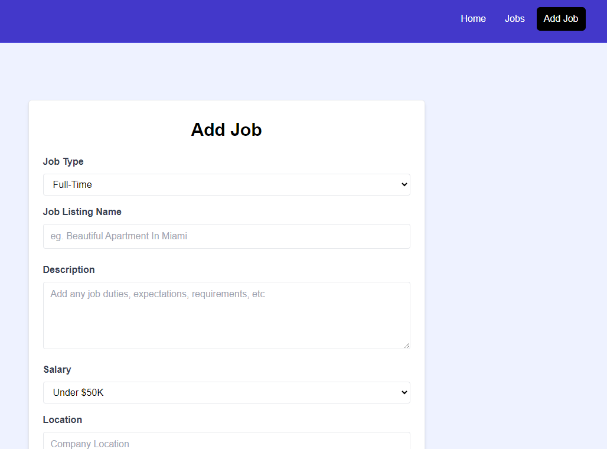

<!-- <b>In package.json</b> 
if need the original server 
"server": "json-server --watch src/jobs.json --port 8000" -->

# Job Finder
#### Video Demo:  <[Job Finder](https://youtu.be/zFZRRQ91who)>
#### Description:

<b><em>Special thanks to <a href="https://www.youtube.com/@TraversyMedia">Traversy Media</a> for the beginner tutorial of React frontend.</em></b>

Traversy Media (2024) React crash course 2024, YouTube. 
Available at: https://www.youtube.com/watch?v=LDB4uaJ87e0 (Accessed: 09 June 2024).  

Job Finder is a web application that allows job finder to view existing jobs available in the market and he may contact the job poster via contact phone number or contact email. Meanwhile, it also allows job poster to add new job positions to the market, edit existing jobs and delete existing unwanted jobs.

This web application utilizes the following :
- Frontend - React with Tailwind CSS Framework
- Backend - Flask
- Database - Sqlite3 

Project is running in two separate folders, where the `client` folder is where frontend files are stored and the `server` folder is where backend files are stored.

The following is the tree structure of `client` folder.
- [**client**](client)
    - [**public**](client/public)
    - [**src**](client/src) - All frontend react files are located
        - [**assets**](client/src/assets)
            - [**images**](client/src/assets/images)
                - [find_job_logo.png](client/src/assets/images/find_job_logo.png) - Logo for navbar
        - [**components**](client/src/components)
            - [Hero.jsx](client/src/components/Hero.jsx) - Main title for the home page
            - [Card.jsx](client/src/components/Card.jsx) - Two options provided, browse or add jobs
            - [HomeCards.jsx](client/src/components/HomeCards.jsx) - Contains the two cards components
            - [Joblisting.jsx](client/src/components/Joblisting.jsx) - Displays each joblisting components
            - [Joblistings.jsx](client/src/components/Joblistings.jsx) - Displays all `jobslistings` components available
            - [Navbar.jsx](client/src/components/Navbar.jsx)   - Displays navbar component with all links navigating among pages
            - [Spinner.jsx](client/src/components/Spinner.jsx) - Show a spinner when loading
            - [ViewAllJobs.jsx](client/src/components/Viewalljobs.jsx) - Link to `/jobs` page
        - [**layouts**](client/src/layouts) 
            - [MainLayout.jsx](client/src/layouts/Mainlayout.jsx) - Contains `Navbar` component, so that it can be called at every page
        - [**pages**](client/src/pages)
            - [AddjobPage.jsx](client/src/pages/AddjobPage.jsx) - Adds new job when submitting the form
            - [EditJobPage.jsx](client/src/pages/EditJobPage.jsx) - Preloads the form with existing data and update the data when updated
            - [HomePage.jsx](client/src/pages/HomePage.jsx) - Contains `Hero`, `Homecards`, `Joblistings` and `ViewAllJobs` components
            - [JobPage.jsx](client/src/pages/JobPage.jsx) - Displays data according to the specific ID, allows edit and delete function of the data
            - [JobsPage.jsx](client/src/pages/JobsPage.jsx) - Contains `JobListings` component
            - [NotFoundPage.jsx](client/src/pages/NotFoundPage.jsx) - Triggers when the page is not found
        - [App.jsx](client/src/App.jsx) - Contains all pages and API calls to interact with backend
        - [index.css](client/src/index.css) - Where Tailwind CSS is imported
        - [jobs.json](client/src/jobs.json) - Contains sample data for databse to display in frontend
        - [main.jsx](client/src/main.jsx) - Calls `App` component to  render the whole application 
        - [index.html](client/index.html) - Contains script called `main.jsx`
          
    - configuration files:
        - [.eslintrc.cjs](client/.eslintrc.cjs)
        - [package.json](client/package.json)
        - [package-lock.json](client/package-lock.json)
        - [postcss.config.js](client/postcss.config.js)
        - [tailwind.config.js](client/tailwind.config.js)
        - [vite.config.js](client/vite.config.js)

The following is the tree structure of `server` folder
- [**server**](server) - All backend Flask files are located
    - [jobs.db](server/jobs.db) - Database for storing all data that required to be displayed in the frontend
    - [populate_data.py](server/populate_data.py) - For populating sample data from [jobs.json](client/src/jobs.json) in `client/src` folder
    - [routes.py](server/routes.py) - All APIs for interacting with database and fronend are stored

 
To run this project:

 

Optionally, you may create virtual environment for both folders. 

Open two terminals, one for `server` folder and one for `client` folder. 

In `server` folder, run `npm install --save` and `pip install requirements.txt` to install necessary NodeJS dependencies (nodemon) and Python modules 
After installing, run `npx nodemon routes.py` to start the backend server

In `client` folder, run `npm install --save` to download necessary dependencies. 
After installing, run `npm run dev` to start the frontend application
 
<h2>Introduction to the project:</h2>

When both terminals are connected, the web application is running and you will see the above page.  

 
Here's the navigtion bar:
1. Directing to home page
2. Directing to jobs page, which shows all jobs available
3. Directing to Add job page, where user can add new job
  

 
Here's few buttons to interact with: 
 &nbsp;&nbsp;&nbsp;&nbsp;&nbsp;&nbsp;4. Directing to jobs page
 &nbsp;&nbsp;&nbsp;&nbsp;&nbsp;&nbsp;5. Directing to Add job page
 &nbsp;&nbsp;&nbsp;&nbsp;&nbsp;&nbsp;6. Directing to selected job page
 &nbsp;&nbsp;&nbsp;&nbsp;&nbsp;&nbsp;7. Directing to jobs page
  

Once in selected job page, user is allowed to :
 &nbsp;&nbsp;&nbsp;&nbsp;&nbsp;&nbsp;8. Go back to home page
 &nbsp;&nbsp;&nbsp;&nbsp;&nbsp;&nbsp;9. Directing to edit page for editing the selected job
 &nbsp;&nbsp;&nbsp;&nbsp;&nbsp;&nbsp;10. shows a browser prompt asking user whether he wanted to delete the selected job. If deleted, data will be removed in database
  

Edit job page shows a form with pre-filled data of the selected job. User is allowed to edit the data and press the `Update Job` button to submit and data will be modified accordingly.
  

Similar to `editJobPage` form, addJob Page allows user to insert new jobs to the database by clicking on the `Add Job` button. Default validation provided by the web browser is implemented also. 

 
Last modified: 14/6/2024